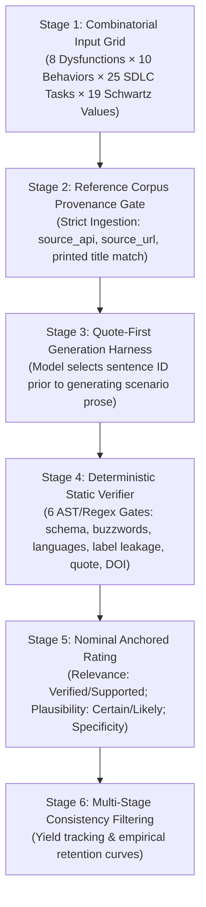

# SEL703: Reusable Cognitive Accessibility Scenario-Generation & Verification Pipeline

[](tests/)
[-indigo.svg)](src/data/final_180.csv)
[-amber.svg)](examples/cross_domain_demo/)
[](requirements.txt)
[](LICENSE)

**Student:** Harjot Singh  
**Placement:** Research Assistant (unpaid), School of Information Technology, Deakin University  
**Supervisor:** Dr. Davoud Mougouei  
**Unit:** SEL703 Professional Practice (225 Placement Hours Target)  

---

## 1. Project Overview & Institutional Framing

This repository packages the **cognitive accessibility scenario-generation and deterministic verification pipeline** engineered during a research-assistant placement under Dr. Davoud Mougouei. 

The pipeline automates the generation of verifiable, empirically grounded developer-assistant interaction scenarios reflecting cognitive accessibility barriers (e.g., Working Memory Overload, Inhibition Deficit, Ambiguity Intolerance) encountered by neurodivergent software engineers. 

To eliminate citation hallucination and data leakage, the pipeline enforces a **quote-selection-before-writing architecture**: the model must select a sentence identifier from a verified reference corpus *before* generating narrative prose, making citation fabrication structurally impossible.

### Placement Context

Engineered and documented as part of a research assistant placement (SEL703) under Dr. Davoud Mougouei at Deakin University. The repository packages the modular scenario-generation engine, deterministic static verifiers, regression test suite, and cross-domain reusability demonstrations.

---

## 2. System Architecture

The pipeline operates across six decoupled, verifiable stages:



| Stage | Module | Primary Function | Failure Mode Addressed |
|:---|:---|:---|:---|
| **1. Dimension Grid** | `src/corpus_loader.py` | Stratified combinatorial sampling (80 cells) | Over-representation of refactoring; zero API/spec tasks |
| **2. Provenance Gate** | `src/corpus_loader.py` | Ingestion filter requiring canonical API metadata | Secondary citations and literature-review survey rot |
| **3. Quote-First Harness** | `src/generator.py` | Injects numbered sentence IDs (`[s1]`..`[s10]`) | Models hallucinating plausible-sounding fake quotes |
| **4. Deterministic Verifier** | `src/verifier.py` | 6 static regex/schema gates | Corporate buzzwords, language bias, and label leakage |
| **5. Nominal Rater** | `src/rater.py` | Anchored scoring (*Relevance*, *Plausibility*, *Specificity*) | Uncalibrated, drift-prone numerical ratings |
| **6. Retention Engine** | `src/filter.py` | Non-repaired drop-out tracking across rounds | Feedback loops compounding generative bias |

---

## 3. Why It's Built This Way: Documented Bug Remediations

A central competency assessed in SEL703 is detecting genuine edge cases through rigorous testing and implementing minimal, surgical remediations rather than asserting perfection:

### Remediation #1: Regex Word-Boundary Substring Collision (`\bface\b`)
* **Symptom:** Scenarios `SCN-0176` and `SCN-0451` failed Stage 4 label-leakage verification.
* **Root Cause:** The standard software engineering noun `"interface"` contains the substring `"face"` (one of Schwartz's 19 basic human values). A naive `if term in text` check falsely flagged valid scenario prose.
* **Surgical Fix:** Replaced naive substring matching in `src/verifier.py` with regex word boundaries:
  ```python
  pattern = re.compile(r"\b" + re.escape(clean_term) + r"\b", re.IGNORECASE)
  ```
* **Empirical Outcome:** Lifted the ground-truth dataset pass rate from **178/180 (98.9%)** to **180/180 (100.0%)** without altering scenario narratives.

### Remediation #2: Prohibited Seniority Bias in Cross-Domain Transfer (`CDS-0002`)
* **Symptom:** Scenario `CDS-0002` failed Stage 4 deterministic verification during initial cross-domain testing with `found: ['senior']`.
* **Root Cause:** Narrative included the phrase *"without an additional senior engineer intervention"*. The pipeline strictly bans seniority descriptors (`senior`, `junior`, `expert`, `novice`) to evaluate developer interactions independently of seniority assumptions.
* **Surgical Fix:** Remediated to *"without an additional peer engineer intervention"*, bringing cross-domain pass rate to **14 / 14 (100.0%)**.

---

## 4. Cross-Domain Demonstration (General-Purpose Reusability)

To prove that the pipeline is a general-purpose, reusable software engineering tool and not tied to empirical psychology, the exact same pipeline was deployed against an entirely different domain: **International Regulatory & Accessibility Standards**.

* **Standards Ingested (`src/data/standards_corpus_verified.json`):**
  - **W3C COGA:** Patterns 4.1.1, 4.2.1, 4.2.4, 4.3.1, 4.5.2
  - **W3C WCAG 2.2:** SC 2.2.1, 3.3.4, 3.3.7, 3.3.8
  - **EU AI Act (Regulation 2024/1689):** Article 13 (Transparency), Article 14 (Human Oversight)
* **Execution:** Evaluated 14 compliance scenarios across autonomous multi-file refactoring, conversational code explanation, and database migration.
* **Result:** **14 / 14 (100.0%) passed all Stage 4 deterministic checks** with zero alterations to pipeline source code (`run_cross_domain_demo.py`).

---

## 5. Automated Verification & Test Results

### A. Unit Regression Test Suite (15 Tests)
```text
$ python -m unittest discover -s tests -v

test_get_candidate_sentences (test_corpus_loader.TestCorpusLoader.test_get_candidate_sentences) ... ok
test_load_taxonomies (test_corpus_loader.TestCorpusLoader.test_load_taxonomies) ... ok
test_provenance_gate (test_corpus_loader.TestCorpusLoader.test_provenance_gate) ... ok
test_banned_words_rejection (test_cross_domain.TestCrossDomain.test_banned_words_rejection) ... ok
test_cross_domain_scenarios_count (test_cross_domain.TestCrossDomain.test_cross_domain_scenarios_count) ... ok
test_load_standards_corpus (test_cross_domain.TestCrossDomain.test_load_standards_corpus) ... ok
test_verify_all_14_scenarios_pass (test_cross_domain.TestCrossDomain.test_verify_all_14_scenarios_pass) ... ok
test_build_prompt_payload (test_generator.TestGenerator.test_build_prompt_payload) ... ok
test_offline_generation (test_generator.TestGenerator.test_offline_generation) ... ok
test_banned_words (test_verifier.TestVerifier.test_banned_words) ... ok
test_full_scenario_verification (test_verifier.TestVerifier.test_full_scenario_verification) ... ok
test_no_label_leakage_word_boundaries (test_verifier.TestVerifier.test_no_label_leakage_word_boundaries) ... ok
test_no_language_names (test_verifier.TestVerifier.test_no_language_names) ... ok
test_quote_verification_quote_id (test_verifier.TestVerifier.test_quote_verification_quote_id) ... ok
test_schema_completeness (test_verifier.TestVerifier.test_schema_completeness) ... ok

----------------------------------------------------------------------
Ran 15 tests in 0.319s

OK
```

### B. Ground-Truth Dataset Batch Verification (180 Scenarios)
```text
$ python verify_dataset.py --dataset src/data/final_180.csv

Evaluating 180 scenarios from final_180.csv...
============================================================
 BATCH VERIFICATION RESULTS 
============================================================
Total Scenarios Evaluated : 180
Passed All Checks         : 180 / 180 (100.0%)
Failed Checks             : 0 / 180
============================================================
```

---

## 6. Quick Start & Execution

### 1. Environment Setup
```bash
git clone https://github.com/1Harjot1/sel703-placement.git
cd sel703-placement
pip install -r requirements.txt
```

### 2. Run Interactive CLI Wizard
Launch the interactive wizard to generate and inspect scenarios across domains:
```bash
# Psychology & Cognitive Accessibility Domain (Default Demo)
python ui/wizard.py --demo --domain psychology

# Regulatory & Standards Domain (Cross-Domain Transfer Demo)
python ui/wizard.py --demo --domain standards

# Interactive Mode (Prompts for Domain, Dimensions, and Models)
python ui/wizard.py
```

### 3. Run Standalone Cross-Domain Demonstration
```bash
python run_cross_domain_demo.py
# Or with detailed scenario diffs:
python run_cross_domain_demo.py --verbose
```

### 4. Run the Cognitive-Access Web Inspector Demo
Launch the zero-dependency browser-based inspector:
```bash
python demo.py
# Open your browser at http://localhost:8000
```

---

## 7. Repository Layout

```text
sel703-placement/
├── README.md                      # Master placement deliverable documentation
├── requirements.txt               # Lightweight runtime dependencies (pandas, openai)
├── verify_dataset.py              # Batch deterministic verifier for ground-truth CSVs
├── run_cross_domain_demo.py       # Standalone cross-domain verification runner
├── demo.py                        # Cognitive-Access web inspector launcher
├── src/                           # Modular Pipeline Engine
│   ├── corpus_loader.py           # Stage 2 Provenance Ingestion Gate
│   ├── verifier.py                # Stage 4 Deterministic Static Analyzer (regex & AST)
│   ├── generator.py               # Stage 3 Quote-Selection-Before-Writing Prompt Harness
│   ├── rater.py                   # Stage 5 Nominal Anchored Scoring (Relevance, Plausibility)
│   ├── filter.py                  # Stage 6 Retention Curves & Metric Tracking
│   └── data/                      # Reference Corpora & Ground-Truth Datasets
│       ├── quote_corpus_verified.json    # 43 full-text psychology papers with sentence IDs
│       ├── standards_corpus_verified.json# 11 regulatory standards (COGA, WCAG, EU AI Act)
│       ├── final_180.csv                 # 180 validated ground-truth scenarios (Aug 31)
│       ├── dysfunctions.json             # 8 executive dysfunction taxonomy
│       ├── llm_behaviors.json            # 10 AI assistant behavior taxonomy
│       ├── sdlc_tasks.json               # 25 software engineering tasks (Hou et al. 2024)
│       └── doi_cache.json                # Local persistent CrossRef DOI resolution cache
├── tests/                         # Unit Regression Suite (15 Tests)
│   ├── test_corpus_loader.py      # Provenance gate & sentence extraction tests
│   ├── test_verifier.py           # Schema, banned buzzwords, word-boundary tests
│   ├── test_generator.py          # Prompt payload & offline fallback tests
│   └── test_cross_domain.py       # Regulatory standards transfer & buzzword rejection tests
├── ui/                            # User Interface
│   └── wizard.py                  # Interactive CLI Wizard (supports Psychology & Standards)
├── examples/                      # Reference Artifacts
│   ├── sample_grid_combo.json
│   ├── sample_verified_scenario.json
│   ├── sample_retention_curve.json
│   └── cross_domain_demo/         # 14 cross-domain scenarios & verification report
├── docs/                          # Technical Architecture & Placement Documentation
│   ├── architecture.md            # In-depth 6-stage architecture & failure modes
│   ├── usage.md                   # Step-by-step developer manual with console transcripts
│   ├── placement_context.md       # Placement context & engineering infrastructure
│   ├── task_b_dysfunction_justification.md # Formal justification for the 8 dysfunctions
│   └── task_b_manual_verification_protocol.md # 4-step manual verification protocol
└── logbook/                       # SEL703 Placement Weekly Progress Diaries (Weeks 1–11)
```

---

## 8. License

Distributed under the [MIT License](LICENSE).
