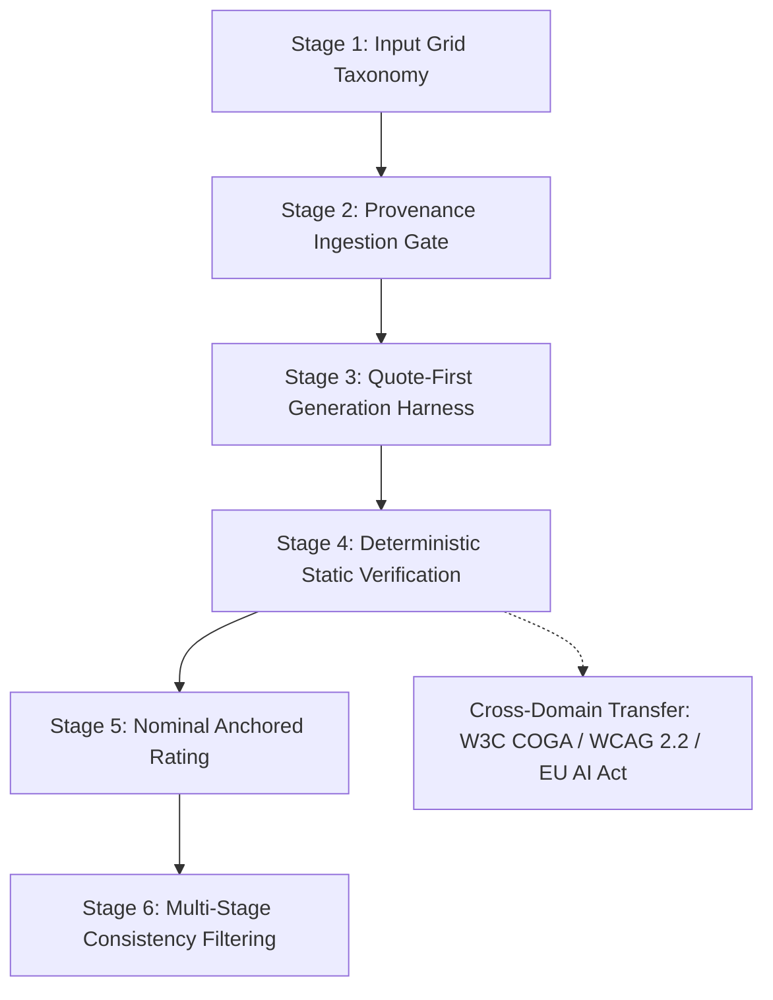
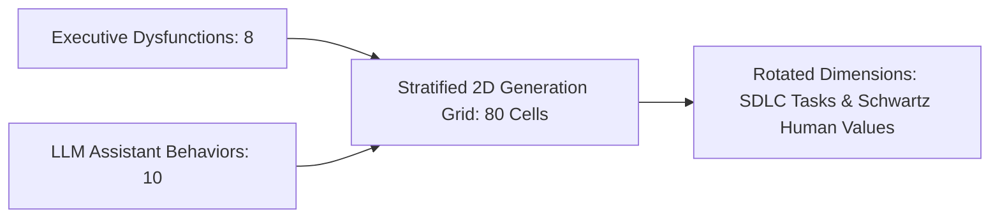
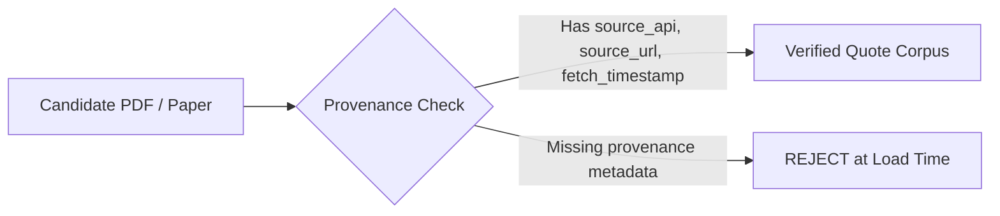
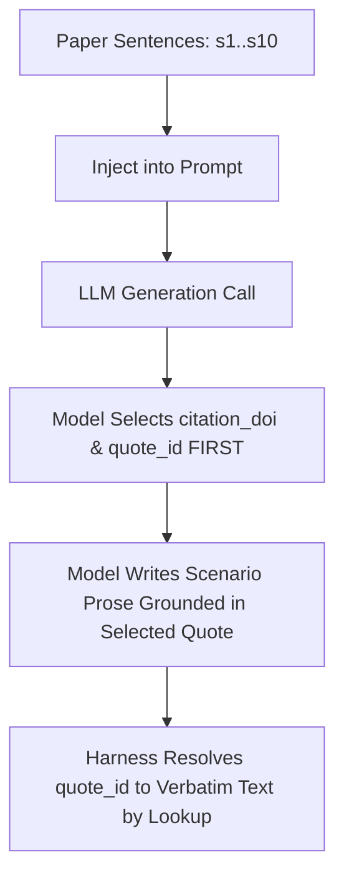
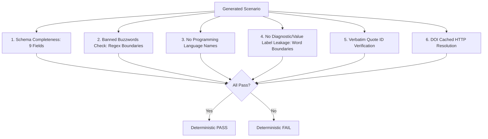
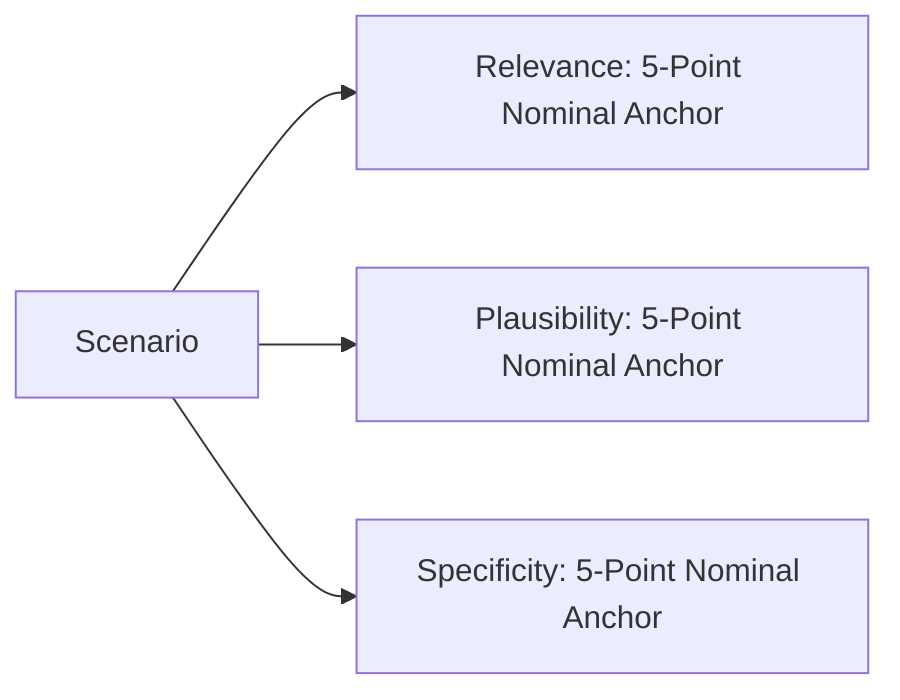
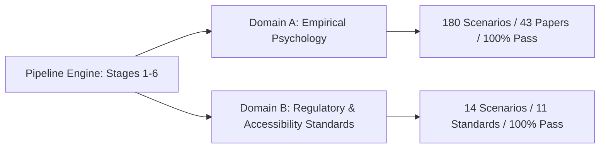

# System Architecture & Pipeline Methodology

This document outlines the six-stage architecture of the grounded scenario-generation pipeline. At each stage, the system enforces strict structural constraints designed in direct response to concrete failure modes encountered during early development.

---

## Stage 1: Input Grid Taxonomy (Dimension Sampling)

### Technical Design
The pipeline structures scenario generation as a 2D grid: **Executive Dysfunctions** (8 dimensions) $\times$ **AI Assistant Behaviors** (10 dimensions) = 80 cells. Each cell is populated across rotated Software Development Life Cycle (**SDLC**) tasks (25 tasks adapted from Hou et al., TOSEM 2024) and **Schwartz Human Values** (19 values from the Schwartz Basic Human Values theory).

### Problem Solved & Failure Addressed
- **Problem:** Ad-hoc or random prompting produces severe sampling skew, over-representing high-salience scenarios while leaving subtle developer workflows unrepresented.
- **Failure Addressed:** Early iterations used unconstrained random sampling, which generated repetitive code-refactoring scenarios while completely ignoring specification synthesis and API recommendation tasks. The generation grid guarantees exhaustive, replicable coverage across all 80 dimension intersections.

---

## Stage 2: Reference Corpus Provenance Ingestion Gate

### Technical Design
The reference corpus loader (`src/corpus_loader.py`) acts as a strict provenance gate. Every paper entry must contain canonical metadata:
- `source_api`: API provenance (e.g. OpenAlex, Semantic Scholar, CrossRef)
- `source_url`: Verifiable landing URL or PDF open-access endpoint
- `fetch_timestamp`: ISO 8601 acquisition timestamp
- `sentences`: Dictionary of clean, extracted body-text sentences (`{"s1": "...", "s2": "..."}`)

Entries failing these criteria are rejected at load time.

### Problem Solved & Failure Addressed
- **Problem:** Citations in automated generation pipelines often suffer from metadata rot, where unverified titles or fabricated URLs contaminate the prompt context.
- **Failure Addressed:** In early iterations, secondary citations from literature reviews were mistakenly ingested as primary empirical sources. Enforcing the provenance gate at ingestion guarantees that only verified papers with extracted body-text sentences reach the generation stage.

---

## Stage 3: Quote-First Generation Harness

### Technical Design
Rather than allowing the LLM to freely cite papers or invent quotes, the harness injects a numbered menu of candidate sentences (`[s1]` through `[s10]`) extracted from the target psychology paper. The generation prompt explicitly requires the model to output:
1. `citation_doi`: Target paper DOI.
2. `quote_id`: The exact sentence identifier (e.g. `s68`).

The pipeline harness resolves `quote_id` directly against `quote_corpus_verified.json`, extracting the verbatim sentence directly from the ground-truth corpus.

### Problem Solved & Failure Addressed
- **Problem:** LLMs frequently hallucinate plausible-sounding quotations from real authors.
- **Failure Addressed:** In early unconstrained runs, the model fabricated a "quotation" that was actually the title of a paper rearranged into a grammatically fluent sentence. Under the quote-first architecture, the model never writes the quotation text; it only selects an identifier from pre-vetted sentences, making fabricated quotes structurally impossible.

---

## Stage 4: Deterministic Static Verification

### Technical Design
The verifier (`src/verifier.py`) applies 6 automated checks:
1. **Schema Completeness:** Validates that all 9 required fields (`summary`, `full_scenario`, `impact`, `reasoning`, `intervention`, `value_violated`, `behaviour`, `citation_doi`, `quote_id`) exist and contain non-empty strings.
2. **Banned Buzzwords:** Flags corporate AI hype words (`seamlessly`, `robust`, `paradigm`, `innovative`, `transformative`).
3. **Language Neutrality:** Ensures scenarios are language-agnostic by banning specific languages (`python`, `java`, `typescript`, etc.) and frameworks (`react`, `django`).
4. **No Label Leakage (Word Boundaries):** Confirms that internal taxonomy names (dysfunction names or Schwartz values) do not appear in the narrative. Crucially, uses word boundaries (`\b`) so that standard software terms like `"interface"` do not trigger false positives for the Schwartz value `"face"`.
5. **Verbatim Quote Match:** Resolves `quote_id` against the verified sentence dictionary.
6. **DOI Resolution:** Validates DOI syntax and checks against the local cache (`doi_cache.json`).

### Problem Solved & Failure Addressed
- **Problem:** Silent failures and prompt leakage degrade benchmark quality.
- **Failure Addressed:** A naive substring search in legacy scripts checked `if term in text`, causing scenarios describing *"interface promises"* (`SCN-0176` and `SCN-0451`) to falsely fail label leakage because `"interface"` contains `"face"`. Enforcing strict regex word boundaries (`\bface\b`) eliminated this false positive, bringing the pass rate on the final 180 dataset from 178/180 (98.9%) to 180/180 (100.0%).

---

## Stage 5: Nominal Anchored Rating

### Technical Design
Rather than using arbitrary uncalibrated numerical scales (e.g. 1–10), the pipeline uses nominal anchored rubrics based on the *Information and Software Technology* (2026) methodology:

1. **RELEVANCE (Evidence-based Interpretive Distance):**
   - **Verified (5):** Direct reference to cited psychology evidence; no interpretation needed.
   - **Supported (4):** Traceable to cited psychology evidence with minor interpretation.
   - **Partial (3):** Traceable to cited psychology evidence with some interpretation.
   - **Doubtful (2):** Traceable with significant interpretation.
   - **Unfounded (1):** Not traceable to cited evidence.

2. **PLAUSIBILITY (Operational Likelihood):**
   - **Certain (5), Likely (4), Possible (3), Unlikely (2), Implausible (1).

3. **SPECIFICITY (Level of Concrete Detail):**
   - **Specific (5), Detailed (4), General (3), Broad (2), Vague (1).

### Problem Solved & Failure Addressed
- **Problem:** Numerical rating scales suffer from arbitrary scoring variance and subjective inflation.
- **Failure Addressed:** Grounding evaluators in explicit nominal anchors prevents score compression and aligns evaluations with peer-reviewed empirical standards.

---

## Stage 6: Consistency Filtering & Retention Curves

### Multi-Round Stopping Criteria
The pipeline evaluates candidate scenarios across multiple rounds. A candidate is retained as **High-Quality** only if:
1. It passes all 6 Stage 4 deterministic checks (100% pass).
2. It achieves **Relevance** $\in$ `{Verified, Supported}`.
3. It achieves **Plausibility** $\in$ `{Certain, Likely}`.
4. It achieves **Specificity** $\in$ `{Specific, Detailed}`.

### Empirical Retention Curves

#### A. Final Curated Dataset ($N = 180$ in `final_180.csv`)
The production deliverable dataset consists of 180 scenarios:
- **Deterministic Pass Rate:** **180 / 180 (100.0%)** (with word-boundary remediation).
- **Relevance Breakdown:**
  - **Supported:** **67 / 180 (37.2%)**
  - **Partial:** **104 / 180 (57.8%)**
  - **Doubtful:** **9 / 180 (5.0%)**
  - **Unfounded:** **0 / 180 (0.0%)**
- **Plausibility Breakdown:**
  - **Likely:** **180 / 180 (100.0%)**
- **Specificity Breakdown:**
  - **Specific:** **165 / 180 (91.7%)**
  - **Detailed:** **15 / 180 (8.3%)**

#### B. Upstream Raw Generation Pool ($N = 1,000$ in `full_evaluated_scenarios_960.json`)
The broader generation pool illustrates the multi-stage retention funnel:
1. **Raw Scenarios Generated:** 1,000
2. **Passed Stage 4 Deterministic Checks:** 990 / 1,000 (99.0%)
3. **Strict High-Quality Retained Candidates:** **291 / 1,000 (29.10%)**
4. **Inclusive Candidates (+Partial Relevance):** **892 / 1,000 (89.20%)**

---

## Cross-Domain Architecture Transfer

To demonstrate domain independence, `src/corpus_loader.py` and `src/verifier.py` implement standard-agnostic verification interfaces:
- `load_standards_corpus(data_dir)`: Loads W3C COGA, W3C WCAG 2.2, and EU AI Act directives.
- `verify_standards_scenario(scen, corpus)`: Verifies regulatory section URLs, quote IDs, banned words, and language neutrality.
- **Empirical Proof:** All 14 cross-domain scenarios pass deterministic Stage 4 checks with zero code alterations to the core pipeline.
